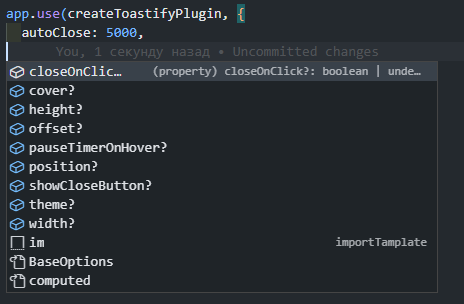
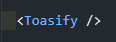
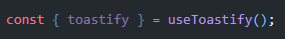
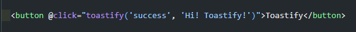

<h1 style='border-bottom: 1px solid #ccc'>Requirements</h1>
<p>vue version >=3.2.0</p>
<h1 style='border-bottom: 1px solid #ccc'>Installation</h1>
```
npm install vue-toastify
```
<h1 style='border-bottom: 1px solid #ccc'>Guide</h1>
<h5>Step 1: Connection</h5>
<p>First, you need to connect the plugin in the root of your project. When connecting, you can pass additional parameters such as delay, topic, position, etc.</p>
<div style='text-align:center;'>

</div>
<p>The project is written in TypeScript, so there will be hints for parameters</p>
<h5>Step 2: Import the toastify component</h5>
<p>Next, you need to import the toast component into the project</p>
<div style='text-align:center;'>

</div>
<h5>Step 3: Import hook</h5>
<p>Importing the <em><strong> useToastify() </em></strong>hook</p>
<div style='text-align:center;'>

</div>
<h5>Step 3: Toastify</h5>
<p>Next, we need to pass 2 parameters to .<em><strong>toastify()</em></strong>, the first is the status, the second is the message.</p>
<div style='text-align:center;'>

</div>
</br>
<p>The toastify is ready to go!</p>