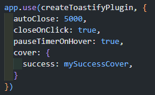
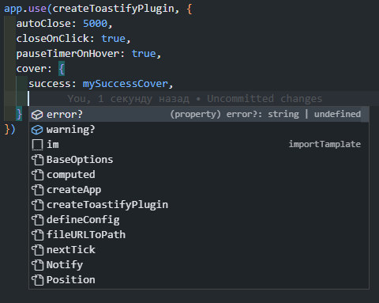
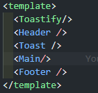

<h1 style='border-bottom: 1px solid #ccc'>Requirements</h1>

vue version >=3.2.0

<h1 style='border-bottom: 1px solid #ccc'>Installation</h1>
<code>npm install vue-toastify</code>
<h1 style='border-bottom: 1px solid #ccc'>Guide</h1>
<h5>Step 1: Connection</h5>

First, you need to enable the plugin in the root of your project. When connecting, you can pass additional options such as delay, theme (day/night), position (top left, top center, top right, bottom right, bottom left), hover delay pause, close toast on click or click on the cross, offset, and your own toast cover saver.

First, we import the plugin

Then import the styles

Now connect the plugin and pass the parameters

To add your own cover, you need to import it first

And pass it as a parameter

You can change the cover of the three types of toast if needed, just import and pass them as parameters.

The project is written in TypeScript, so there will be hints for parameters

<h5>Step 2: Import the toastify component</h5>

Next, you need to add the toastify component, it does not need to be imported, it is registered globally

<h5>Step 3: Import hook</h5>

Importing the <em><strong> useToastify() </em></strong>hook

<h5>Step 3: Toastify</h5>

Next, we need to pass 2 parameters to <em><strong>toastify()</em></strong>, the first is the status, the second is the message.

You can use several toasts at the same time.

 

The toastify is ready to go!

With the "success" status, the "day" theme will look like this:

With the "warning" status:

With the "error" status:

With the "default" status:

With the "success" status, the "night" theme will look like this:

With the "warning" status:

With the "error" status:

